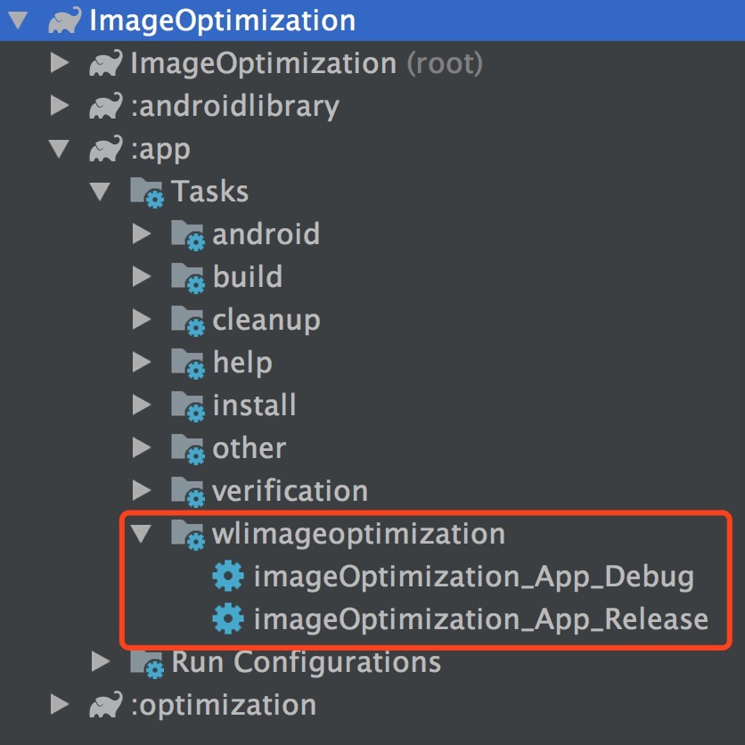
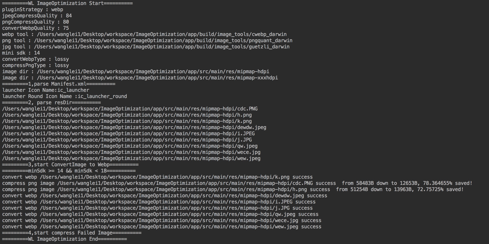

# ImageOptimization

安卓图片优化插件：能有效减少apk安装包大小，支持png/jpg转为webp，支持png图片有损无损压缩，支持jpg有损压缩

### 支持的os

`macOS`、`windows10`上已经测试通过，linux上暂时没测试。

### 引入ImageOptimization

在Project的build.gradle文件中:  

```
buildscript {
    repositories {
        jcenter()
    }
    dependencies {
        ...
        classpath 'com.wanglei.image-optimization:optimization:2.0'
    }
}
```  

在你想要优化的module的build.gradle文件中引入插件: 如在多个module使用则每个module都要引入插件 

`apply plugin:'com.wanglei.image-optimization'`  

同步之后会生成如下任务：双击执行任务即可

  

### 任务生成规则

imageOptimization_module名字_variant名字

### 配置项

在module的build.gradle文件中添加配置选项，配置插件优化的策略以及参数:  

```
ImageOptimization{
    pluginStrategy = "compress"
    convertWebpQuality = 80
    jpegCompressQuality = 90
    appIconName = "ic_launcher"
    appIconRoundName = "ic_launcher_round"
    convertWebpType = "lossy"
    compressPngType = "lossless"
    pngCompressQuality = 79
    filter{
        filterDirs = ["mipmap-hdpi","mipmap-xhdpi","mipmap-xxhdpi"]
        filterImageNames = ["cdc.PNG","wew.jpeg","c.png"]
    }
}
```  
ImageOptimization支持多项参数配置，灵活度高，可根据项目需要自己配置参数，可配置优先转为webp不能转换的在进行图片的压缩，同样你也可以配置只进行图片的压缩而不转为webp

### 配置项参数说明

| 参数 | 是否必须 |参数配置 |参数说明 |
|--|--|--|--|
| pluginStrategy | 否 | 可配置"webp"或者"compress" | 插件运行策略参数：如配置为"webp"则会将图片优先转为webp格式，如果不能转换或者转换失败或转换为图片更大则进行图片的压缩，如配置为"compress"则只进行图片的压缩不会转为webp，此参数如不配置默认为"compress" |
| convertWebpType | 否 | 可配置"lossy"或者"lossless" | webp转换类型参数："lossy"转为webp采用有损转换模式，"lossless"转为webp采用无损模式，此参数默认为"lossy" |
| compressPngType | 否 | 可配置"lossy"或者"lossless" | png图片压缩类型参数："lossy"为压缩png采用有损压缩模式，"lossless"为压缩png采用无损压缩模式，此参数默认为"lossy" |
| pngCompressQuality | 否 | 可配置范围为[0,100] | png图片压缩质量参数：默认为80，建议使用默认即可，此参数为compressPngType为"lossy"时起作用，也就是有损压缩才起作用 |
| convertWebpQuality | 否 | 可配置范围为[0,100] | 图片转为webp的质量参数：默认为75，此参数为谷歌建议的参数，建议不要更改，转换webp有损模式下此参数才起作用 |
| jpegCompressQuality | 否 | 可配置范围为[84,100] | jpg图片压缩质量参数：默认为84 |
| appIconRoundName | 否 | 项目app圆形启动图标的名字，不包括图片扩展名 | 如圆形启动图标为：icon_round.png，这里配置为icon_round |
| appIconName | 是 | 项目app启动图标的名字，不包括图片扩展名 | 如启动图标为：icon.png，这里配置为icon |
| filterDirs | 否 | 不需要过滤的图片目录名 | 如 filterDirs = ["mipmap-hdpi","mipmap-xhdpi"] ，mipmap-hdpi与mipmap-xhdpi目录下图片资源保持原样|
| filterImageNames | 否 | 不需要过滤的图片的名字 | 如 filterImageNames = ["cdc.PNG","wew.jpeg"] ，cdc.PNG与wew.jpeg图片均保持原样，这里要配置完整的图片名包括扩展名并且区分大小写|

### 图片压缩效果对比

#### PNG图片
| 原图 | 有损转为webp | 无损转为webp | lossy有损压缩 | lossless无损压缩 |
|--|--|--|--|--|
|  |  |  |  |  |
| 50.05k | 15.28k | 30.30k | 13.64k | 42.21k |

#### jpg图片
| 原图 | 有损转为webp | lossy有损压缩 |
|--|--|--|
|  |  |  |
| 7.91k | 2.82k | 5.17k |

#### 由于GitHub有时不能正常显示webp图片，上图webp图片可能无法正常显示，可到imageafter文件夹中查看对应图片

###  额外说明

#### 插件运行的时候会有相应信息打印出：

  

#### 安卓对webp图片的支持

安卓不同sdk版本对webp的支持有所不同，具体如下：

sdk<14:不支持webp格式图片  
14<= sdk <18:支持webp格式图片，但是不支持有透明通道的 webp格式图片  
sdk >=18:有透明通过的webp图片也支持  

此外如果想以无损方式将png/jpg图片转为webp，需要的sdk版本最小为18。

**ImageOptimization对以上情况都做了适配，你只需放心使用即可**

#### .9.png图片的处理

ImageOptimization插件对.9.png图片不做任何处理，既不转换也不压缩保持原样。


